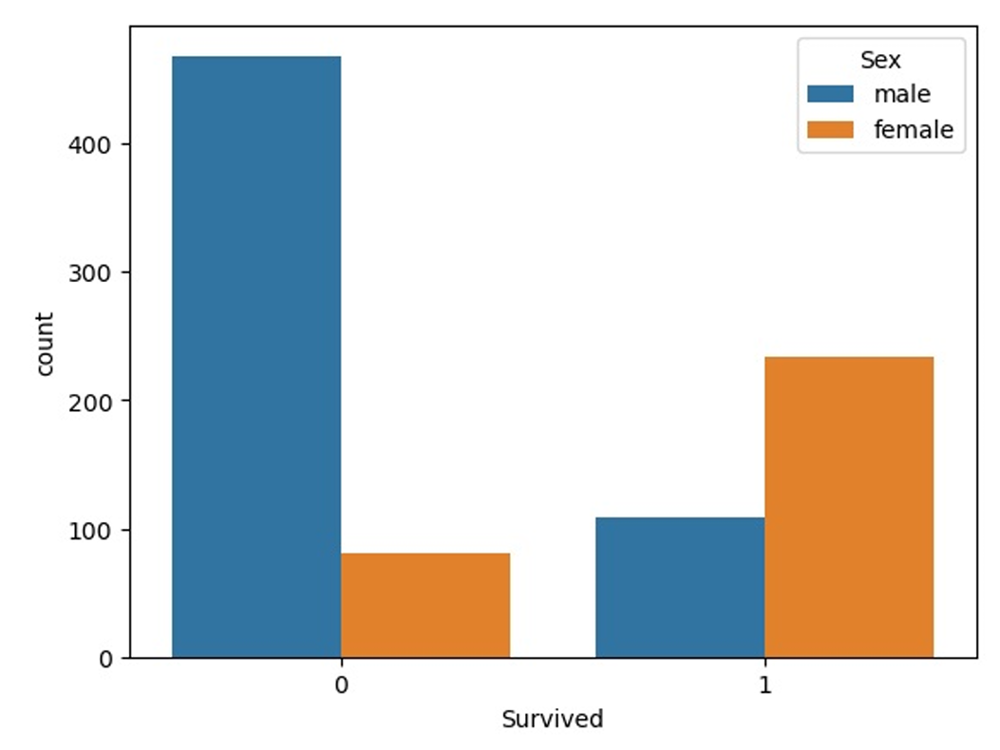
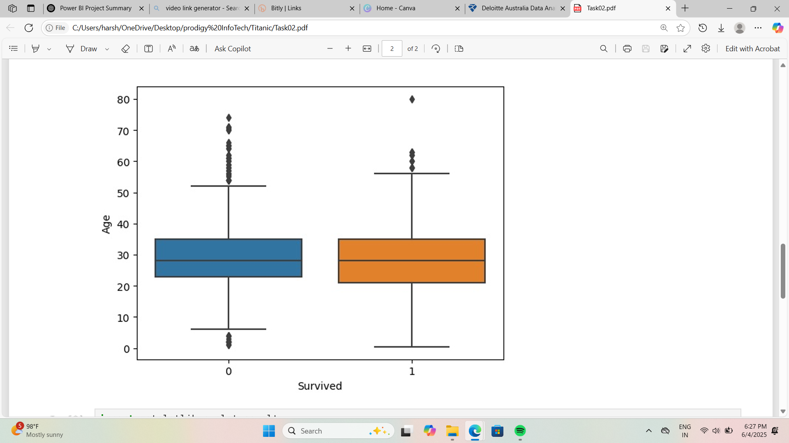
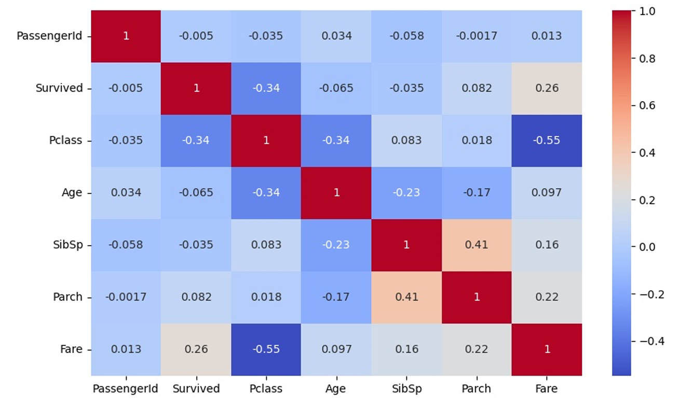

# 🚢 EDA on Titanic Dataset 

This project performs Exploratory Data Analysis (EDA) on the classic **Titanic dataset** from Kaggle. It explores relationships between passenger demographics and survival rates using Python and visualization libraries.

## 🔍 Key Features

- Cleaned dataset by handling missing values in **Age** and **Embarked**
- Removed irrelevant features such as **Cabin**
- Visualized survival rates by:
  - Gender (using `countplot`)
  - Age (using `boxplot`)
  - Passenger class
- Correlation analysis using heatmaps
- Exported cleaned dataset for further use

## 📈 Visuals

### Survival by Gender

### Survival by Age

### Correlation Heatmap

## 🧰 Tools & Libraries

- Python
- Pandas
- Seaborn
- Matplotlib
- Jupyter Notebook

## 📁 Files Included

- `titanic_eda.ipynb` – Code and visualizations
- `train.csv` – Raw dataset
- `cleaned_titanic.csv` – Cleaned and exported dataset
- `.png` charts – Visualization snapshots

## 📌 Internship Context

This project was completed as **Task 02** during my **Data Science Internship at Prodigy InfoTech**, aimed at understanding survival patterns in Titanic passengers through data exploration and visualization.

## 👩‍💻 Author
**Harshitha Adicherla**  

📬 Feel free to explore, fork, or leave feedback!

